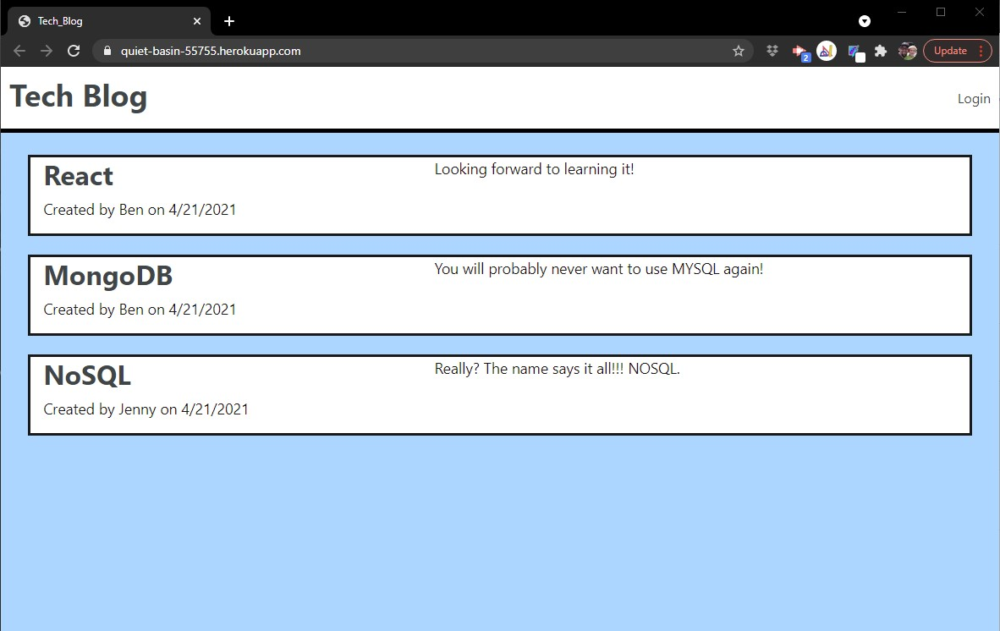

# My Tech Blog

  []

  A CMS Styled site that allows multiple usrs to log in and blog about anything tech. 

  ## Table of Contents
  * [Installation](#Installation)
  * [Usage](#Usage)
  * [License](#License)
  * [Contributing](#Contributing)
  * [Tests](#Tests)
  * [Questions](#Questions)

## Installation

Please follow these steps to ensure a proper installation. 
This is currently running on Heroku, but if you would like to for the repo and run it locally. You will need to seet up a new MySQL database, then run "npm install", and "npm run seed". To start the server you can run "npm start" then open localhost:3001 in your browser of choice. 

## Usage

The following will outline the steps needed to use this project.  
You can create a new user, then add and delete as many posts as you would like. You can also add as many users as you would like. 

## License
The MIT License

Please follow the link to learn more about the License this project is protected under. 
[https://opensource.org/licenses/MIT](https://opensource.org/licenses/MIT)

## Contributing

How can you contribute? 
Feedback! Please let me know any aras where I may have done better. 

## Tests

The following test steps can be taken to ensure the project is running correctly. 
Fork the repo and run locally. 

## Questions

Please contact me with any questions about this project. 

My GitHub URL is [https://github.com/jmalm79](https://github.com/jmalm79)

Email: jmalm79@gmail.com

